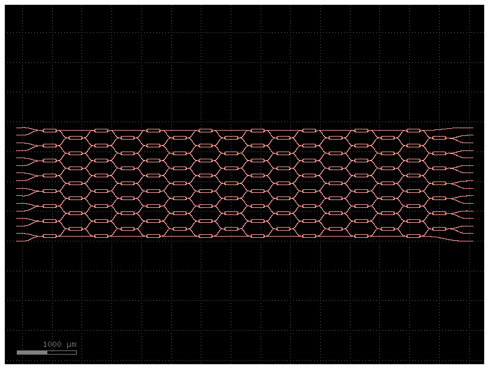

# Optical Neural Network Implementation
This project implements a hybrid optical-electronic neural network architecture for classifying MNIST digits using simulated optical interferometers. The system combines traditional neural network layers with optical computing elements to explore the potential of optical information processing.

## 🌟 Features
- **Optical Linear Layers**: Implementation of optical interferometer-based linear transformations
- **Optical Nonlinear Operations**: Simulated optical nonlinearities (SHG, FWM)
- **Fock State Simulation**: Quantum optical state evolution simulation
- **Hyperparameter Optimisation**: Automated tuning using Optuna
- **MNIST Classification**: Demonstration on the MNIST dataset
- **Modular Architecture**: Flexible combination of optical and electronic components
- **GDS Layout Generation**: Automated creation of photonic circuit layouts

## 🏗️ Architecture
The system consists of several key components:

1. **Optical Linear Layer (`OpticalLinearLayer`):**
   - Implements unitary transformations using beam splitters
   - Supports automatic mode blocking
   - Trainable theta and phi parameters
   - Generates corresponding GDS layout

2. **Adaptive Optical Linear Layer (`OpticalLinearLayer`):**
   - Dynamically learns dimension reduction through adaptive weights instead of fixed masks
   - Uses trainable parameters with sigmoid activation to automatically prioritise important dimensions
   - Maintains physical optical constraints while providing standard PyTorch interface

3. **Optical Nonlinear Layer (`AdaptiveOpticalLayer`):**
   - Implements Second Harmonic Generation (SHG) and Four-Wave Mixing (FWM)
   - Phase matching capabilities
   - Configurable nonlinear coefficients

4. **Segmented Optical Layer (`SegmentedOpticalLayer`):**
   - Handles large-scale optical transformations
   - Segments input for practical hardware implementation
   - Automatic dimension management

5. **MNIST Classifier (`OpticalMNISTClassifier`):**
   - Hybrid architecture combining optical and electronic components
   - Configurable number of optical and reduction layers
   - Dropout regularisation

## 📊 Physical Implementation
### Interferometer Mesh Layout
The project includes automated generation of GDS layouts for the optical interferometer mesh:



Key features of the layout generation:
- Automated placement of Mach-Zehnder interferometers
- Optimised waveguide routing
- Minimal crossing design
- Configurable layer specifications
- Support for different foundry process design kits (PDKs)

### GDS Factory Integration
```python
from create_gds_nxn import create_mesh_interferometer
layout = create_mesh_interferometer(
    N: int,
    tunable_BS,
    coupler_array,
    BS_list,

)
layout.wrtie_gds()
```

## 📊 Performance
The model achieves competitive accuracy on the MNIST dataset while incorporating optical computing elements. Key performance features include:
- Automated hyperparameter optimisation
- Real-time training metrics
- Checkpoint saving for best models
- Comprehensive timing analysis

## 🚀 Getting Started
### Prerequisites
```bash
pip install -r requirements.txt
```

### Training the Model
```python
from onn.model import train_mnist_optical_network
model, save_path = train_mnist_optical_network(
    learning_rate=0.001,
    batch_size=64,
    num_layers=2,
    num_optical_input=16,
    num_optical_layers=2,
    dropout_rate=0.2,
    save_dir="./data/optical_mnist_models",
    save_checkpoint=True
)
```

## 🔧 Implementation Details
### Interferometer Simulation
The project includes a detailed simulation of optical interferometers:
- Beamsplitter implementation
- Unitary matrix decomposition
- Visualisation capabilities
- Fock state evolution
- Physical layout generation

### Custom Optical Layers
The system supports various optical computing paradigms:
- Linear optical transformations
- Nonlinear optical effects
- Segmented processing for scalability
- Phase matching considerations

## 📚 File Structure
- `onn/model`: Main neural network architecture definitions
- `onn/layer`: Implementation of optical computing layers
- `onn/layout`: GDS layout generation tools
- `optics/interferometer.py`: Optical interferometer simulation
- `optics/fock_state_simulation.py`: Quantum optical state evolution
- `optim_hperparam.py`: Hyperparameter optimisation

## 🛠️ Configuration Options
The system is highly configurable with options for:
- Number of optical and electronic layers
- Input/output dimensions
- Nonlinearity types and parameters
- Training hyperparameters
- Device specifications
- Layout parameters (waveguide width, spacing, etc.)
- PDK selection

## 🤝 Contributing
Contributions are welcome! Please feel free to submit a Pull Request.

## 🔗 References
- Clements, William R., et al. "Optimal design for universal multiport interferometers." Optica 3.12 (2016): 1460-1465.
